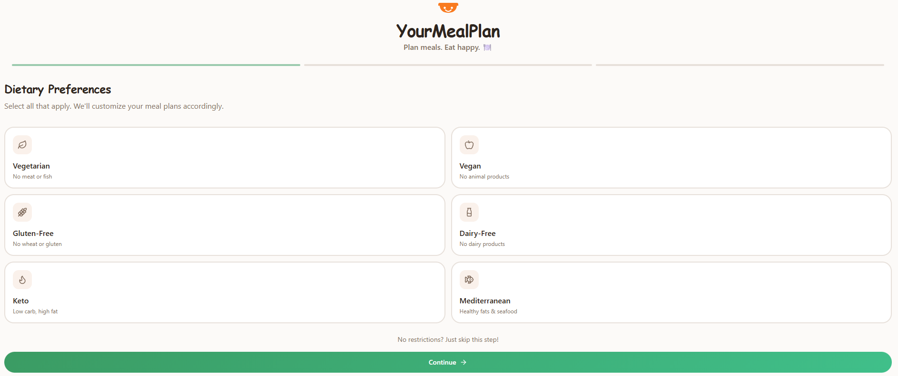
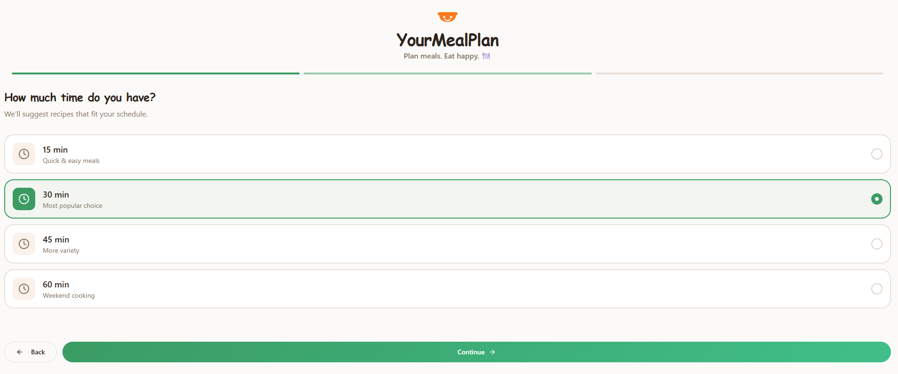
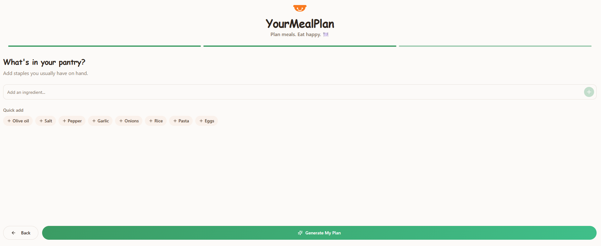
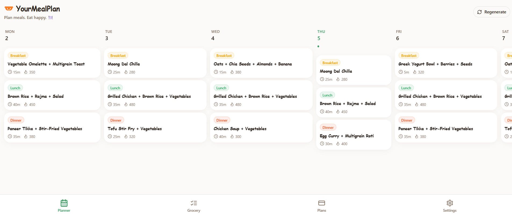
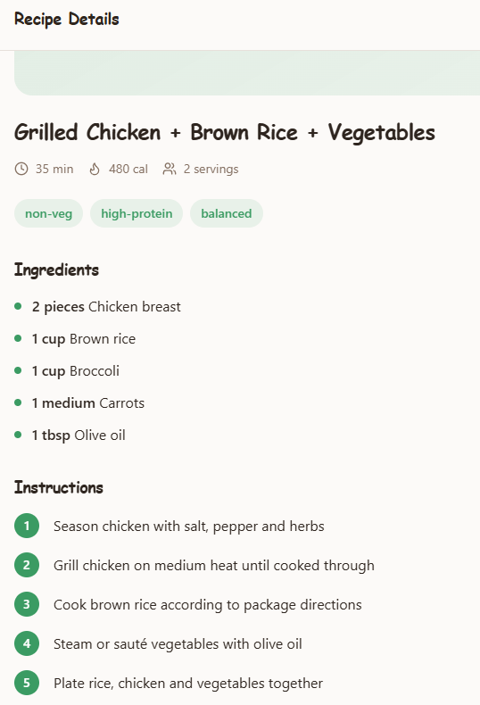
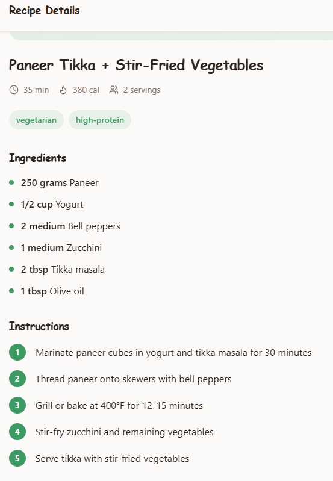

# YourMealPlan

YourMealPlan is a smart weekly meal planning web app that helps users explore balanced meal plans based on dietary preferences.

Users can preview a weekly meal plan and subscribe to generate personalized meal plans.

## Features

- Weekly meal preview
- Diet preference filtering (Vegetarian, Vegan, Gluten-Free, Keto, etc.)
- Personalized meal planning
- Subscription-based access
- Stripe integration (Test Mode)
- Secure authentication using Supabase

## Tech Stack

- React
- Vite
- Tailwind CSS
- Supabase (Authentication & Database)
- Stripe (Subscription payments)
- Lovable (AI development platform)

## How It Works

1. Users can preview a sample weekly meal plan without signing up.
2. To generate personalized meal plans, users need to create an account.
3. Users can subscribe to unlock full meal planning features.
4. Payments are currently configured in **Stripe Test Mode**, so no real money is charged.

## Pricing (Test Mode)

- Weekly Plan – ₹9/week  
- Monthly Plan – ₹14/month  
- 3 Month Plan – ₹29  
- Yearly Plan – ₹89

## Product Walkthrough
Step 1 — Select Dietary Preferences

Users begin by choosing their dietary preferences.
The system supports multiple diet types such as Vegetarian, Vegan, Gluten-Free, Dairy-Free, Keto, and Mediterranean.

Step 2 — Choose Cooking Time

Users select how much time they want to spend cooking.
The app then suggests recipes that match the selected cooking time.

Options include:
15 minutes – quick meals
30 minutes – balanced cooking time
45 minutes – more variety
60 minutes – weekend cooking

Step 3 — Add Pantry Ingredients

Users can add ingredients they already have at home.
The planner prioritizes recipes that use these ingredients to reduce food waste and simplify grocery planning.

Step 4 — Weekly Meal Plan Generation

Based on the user's preferences, available time, and pantry ingredients, the system generates a balanced weekly meal plan including:

Breakfast
Lunch
Dinner
Each meal includes cooking time and calorie estimates.

Step 5 — Recipe Details

Each meal can be opened to view detailed information including:

Ingredients list
Cooking instructions
Preparation time
Calorie information
Serving size

The planner supports veg and non-vegetarian meal plans with balanced nutrition and step-by-step cooking instructions.

🚀 Future Improvements

Possible improvements for the product:
Grocery list auto-generation
Nutrition tracking
AI-based meal recommendations
Mobile responsive optimization
Recipe personalization based on fitness goals

## Project Status

This project is a **portfolio prototype** built for learning and demonstration purposes.

All payments are running in **Stripe Test Mode**.

## Author

**Saqib Mojeeb**
Product & Operations enthusiast exploring product development through hands-on projects.
